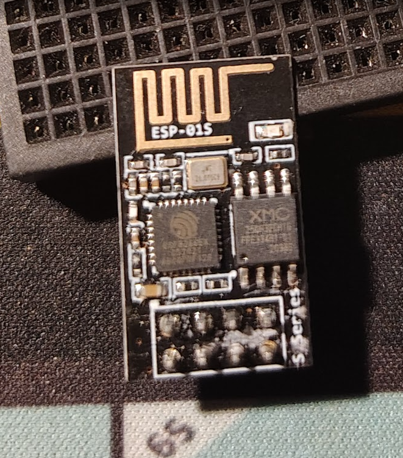
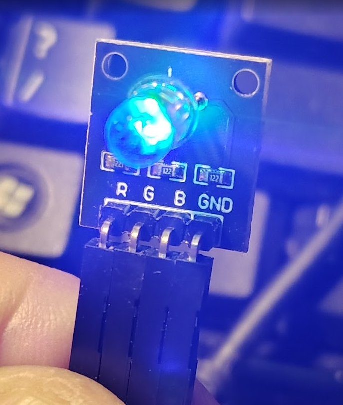
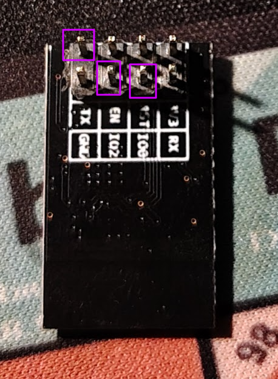
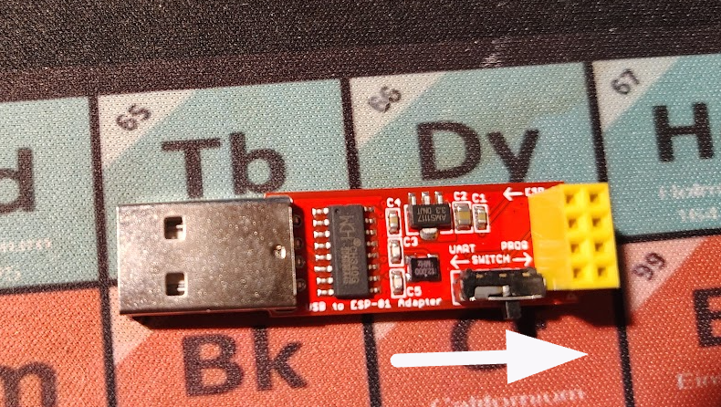

# Tiny RGB for Tiny Display Projects

A smooth rainbow gradient RGB LED controller for the ESP-01S WiFi module, perfect for small display projects, night lights, and decorative illumination. I'm using this project to illuminate a 3D printed tiny case for a vacuum tube "lamp" that continuously cycles through beautiful color transitions.



## Project Features

✨ **Smooth Color Gradients** - Seamless transitions through the full color spectrum  
🔄 **Continuous Loop** - Runs indefinitely, perfect for display pieces  
⚡ **Tiny Footprint** - Uses the compact ESP-01S module  
🎨 **Full RGB Spectrum** - Transitions through red, yellow, green, cyan, blue, and magenta  
🔧 **Adjustable Speed** - Easily customize transition speed and smoothness



## Hardware Requirements

- **1x ESP-01S WiFi Module** (ESP8266-based)
- **1x RGB LED Module** with built-in resistors (R, G, B, GND pins)
- **1x USB-ESP01S Programmer** (recommended) or USB-to-Serial adapter
- **3.3V Power Supply**
- Jumper wires



## ESP-01S Pinout Reference

The ESP-01S has 8 pins arranged in two rows of 4:

```
    [Antenna Side]
    
    GND    GPIO2
    GPIO0  RX
    TX     CH_PD
    VCC    RST
```

**Pin Functions:**
- **Pin 1 (GND)** - Ground
- **Pin 2 (GPIO0)** - GPIO 0 (Boot mode pin) → **Red LED**
- **Pin 3 (GPIO2)** - GPIO 2 → **Green LED**
- **Pin 4 (TX/GPIO1)** - Transmit / GPIO 1 → **Blue LED**
- **Pin 5 (RX)** - Receive (not used in this project)
- **Pin 6 (CH_PD)** - Chip Enable → **Connect to 3.3V**
- **Pin 7 (RST)** - Reset (optional, has internal pull-up)
- **Pin 8 (VCC)** - Power → **3.3V ONLY!**

## Wiring Connections

### RGB LED Module to ESP-01S:

```
RGB LED Module    →    ESP-01S Pin
--------------         -----------
R (Red)          →    GPIO0 (Pin 2)
G (Green)        →    GPIO2 (Pin 3)
B (Blue)         →    TX/GPIO1 (Pin 4)
GND              →    GND (Pin 1)
```

### Power Connections:

```
ESP-01S Pin      →    Power Source
-----------           ------------
VCC (Pin 8)      →    3.3V
CH_PD (Pin 6)    →    3.3V (enables chip)
GND (Pin 1)      →    Ground
```

**⚠️ CRITICAL: ESP-01S uses 3.3V only! Do NOT connect to 5V or you'll damage the module.**

## Programming the ESP-01S

### Recommended: USB-ESP01S Programmer



**Make life easier on yourself!** Use a USB-ESP01S programmer board. These are cheap (~$3-5) and eliminate most wiring headaches.

**IMPORTANT:** Before programming, make sure the switch on the programmer is set towards the **YELLOW breadboard portion** of the board (see arrow in image above). This puts the ESP-01S into programming mode automatically.

**Steps:**
1. Insert ESP-01S into the programmer socket
2. Set switch towards the YELLOW breadboard side
3. Connect USB cable to computer
4. Upload the sketch
5. After upload completes, flip the switch away from the YELLOW side
6. Press the reset button or power cycle to run the program

### Alternative: Manual Programming Mode

If using a USB-to-Serial adapter:

1. **Connect GPIO0 to GND** (this enables programming mode)
2. **Power cycle** the ESP-01S
3. **Upload the sketch**
4. **Disconnect GPIO0 from GND**
5. **Reset** or power cycle to run the program

## Uploading the Sketch

### Using Arduino IDE:

1. **Install ESP8266 Board Support:**
   - Go to `File → Preferences`
   - Add to "Additional Board Manager URLs":
     ```
     http://arduino.esp8266.com/stable/package_esp8266com_index.json
     ```
   - Go to `Tools → Board → Boards Manager`
   - Search for "ESP8266" and install the package

2. **Configure Board Settings:**
   - Board: `Generic ESP8266 Module`
   - Upload Speed: `115200`
   - Flash Size: `1MB (FS:64KB OTA:~470KB)`
   - Flash Mode: `DIO`
   - Crystal Frequency: `26 MHz`

3. **Select your COM port** under `Tools → Port`

4. **Open** `esp01s_rgb_led.ino`

5. **Upload** the sketch

6. **Exit programming mode** (flip switch or disconnect GPIO0 from GND)

7. **Power cycle** the ESP-01S

### Using Arduino CLI:

```bash
# Compile the sketch
arduino-cli compile --fqbn esp8266:esp8266:generic esp01s_rgb_led

# Upload to device (adjust /dev/ttyUSB0 to your port)
arduino-cli upload -p /dev/ttyUSB0 --fqbn esp8266:esp8266:generic esp01s_rgb_led
```

## How It Works

The program creates a smooth color wheel effect that transitions through the full RGB spectrum:

**Red → Yellow → Green → Cyan → Blue → Magenta → Red** (repeats forever)

Each transition is broken into 100 micro-steps with a 15ms delay between steps, creating a buttery-smooth gradient effect. The complete cycle takes approximately 9 seconds.

### Customizing the Effect

You can adjust two constants in the code:

```cpp
#define TRANSITION_DELAY 15    // Lower = faster transitions
#define FADE_STEPS 100         // More steps = smoother gradient
```

**Example Adjustments:**
- **Faster cycling:** Set `TRANSITION_DELAY` to `10` or `5`
- **Slower, meditative:** Set `TRANSITION_DELAY` to `30` or `50`
- **Ultra-smooth:** Set `FADE_STEPS` to `200`

## Troubleshooting

| Problem | Solution |
|---------|----------|
| **LED not lighting** | Check wiring, verify RGB module has power |
| **Only some colors work** | Check individual R, G, B connections |
| **ESP won't boot** | Ensure CH_PD is connected to 3.3V |
| **Can't upload code** | Verify GPIO0 is grounded (or switch is correct) |
| **Module getting hot** | Check voltage - must be 3.3V, NOT 5V! |
| **Upload fails repeatedly** | Try lower baud rate (57600) |

## Use Cases

- 🕯️ **Decorative Lamps** - Vacuum tube lamps, Edison bulb replicas
- 🎨 **Art Installations** - Ambient lighting for sculptures or displays
- 🌙 **Night Lights** - Gentle color-changing illumination
- 🎮 **Prop Lighting** - Cosplay props, model displays
- 💡 **Accent Lighting** - Under-cabinet, behind-TV ambient light
- 🎄 **Holiday Decorations** - Miniature light displays

## Technical Specifications

- **Microcontroller:** ESP8266 (ESP-01S module)
- **Clock Speed:** 80/160 MHz
- **Flash Memory:** 1MB
- **Operating Voltage:** 3.3V
- **GPIO Pins Used:** GPIO0, GPIO1, GPIO2
- **PWM Resolution:** 10-bit (0-1023, mapped to 0-255)
- **Power Consumption:** ~70mA average

## Project Files

- `esp01s_rgb_led.ino` - Main Arduino sketch
- `README.md` - This documentation
- `esp-01s.png` - ESP-01S module reference
- `rgb_led_board.png` - RGB LED module reference
- `pins_used_for_led.png` - Pin connection diagram
- `usb_to_esp-01s_programmer.png` - Programmer setup reference

## License

This project is open source. Feel free to use, modify, and share!

## Contributing

Found a bug or have an improvement? Feel free to open an issue or submit a pull request!

---

**Built with ❤️ for tiny, beautiful display projects**
